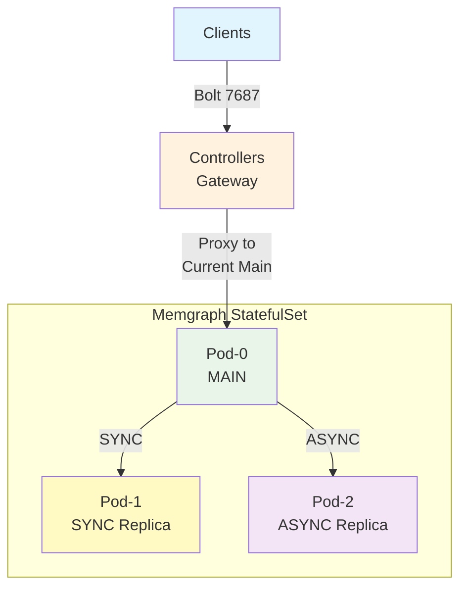

# Memgraph Controller Design Specification


## Architecture Overview

This controller implements a **MAIN-SYNC-ASYNC** replication topology that provides robust write conflict protection and automatic failover capabilities.



### Key Design Principles

1. **Two-Pod Authority**: Only pod-0 and pod-1 are eligible for MAIN/SYNC replica roles
2. **SYNC Replica Strategy**: One SYNC replica ensures zero data loss during failover
3. **Design-Contract-Based Failover**: Controller leverages README.md guarantee that in OPERATIONAL state, either pod-0 OR pod-1 MUST be SYNC replica - eliminating runtime discovery complexity
4. **Immediate Failover**: Sub-second failover response (typically <50ms) with automatic gateway coordination
5. **Write Conflict Protection**: SYNC replication prevents dual-MAIN scenarios

## Write Conflict Protection

The MAIN-SYNC-ASYNC topology provides robust protection against write conflicts through Memgraph's built-in SYNC replication mechanism:

### How SYNC Protection Works

1. **MAIN Dependency**: The MAIN cannot commit transactions until the SYNC replica acknowledges them
2. **Promotion Safety**: When a SYNC replica is promoted to MAIN, it stops acknowledging the old MAIN
3. **Write Blocking**: The old MAIN becomes write-blocked when its SYNC replica becomes unavailable
4. **Clean Failover**: Only the new MAIN can accept writes, preventing dual-MAIN conflicts

### Conflict Scenarios Analysis

#### ✅ **Network Partition** (Protected)
- **Scenario**: Controller loses connection to MAIN but MAIN can reach replicas
- **Protection**: When SYNC replica is promoted, it stops acknowledging old MAIN transactions
- **Result**: Old MAIN becomes write-blocked, new MAIN handles all writes

#### ✅ **Controller Split-Brain** (Protected)  
- **Scenario**: Multiple controllers try to manage the same cluster
- **Protection**: SYNC replica can only acknowledge one MAIN at a time
- **Result**: Only one MAIN remains operational, others become write-blocked

#### ✅ **Gradual Failure** (Protected)
- **Scenario**: MAIN becomes slow/degraded but not completely failed  
- **Protection**: SYNC replica promotion immediately blocks old MAIN writes
- **Result**: Clean transition to new MAIN without conflicts

#### ⚠️ **Manual Intervention** (Risk)
- **Scenario**: Manual `DROP REPLICA` commands or configuration changes
- **Protection**: None - manual changes can override safety mechanisms
- **Mitigation**: Operational procedures and access controls

## Controller Lifecycle

This controller has two phases throughout its lifecycle: BOOTSTRAP and OPERATIONAL.

### Bootstrap Phase

Controller starts up as BOOTSTRAP phase, which goal is discover current state of a memgraph-ha-cluster.

In this phase, Gateway REJECTS any bolt client connections.

Below describes the rules, which are expected to be deterministic.

1. If kubernetes status of pod-0 and pod-1 is not ready, wait. Proceed to next step ONLY after pod-0 and pod-1 are ready.

2. If both pod-0 and pod-1 have replication role as `MAIN` and storage shows 0 edge_count, 0 vertex_count, this cluster is in `INITIAL_STATE`.

3. If one of pod-0 and pod-1 has replication role as `REPLICA`, the other one as `MAIN`, this cluster is in `OPERATIONAL_STATE`.

4. Otherwise, the cluster is in `UNKNOWN_STATE`.

#### INITIAL_STATE

Controller always use pod-0 as MAIN, pod-1 as SYNC REPLICA.

Controller will perform following steps to set up the cluster, and then go into OPERATIONAL phase.

1. Run this command against pod-1 to demote it into replica:

```mgconsole
SET REPLICATION ROLE TO REPLICA WITH PORT 10000
```

2. Run this command against pod-0 to set up sync replication:

```mgconsole
REGISTER REPLICA <pod_1_name> SYNC TO "<pod_1_ip>:10000"
```
3. Run this command against pod-0 to verify replication:

```mgconsole
SHOW REPLICAS
```

Replication `<pod_1_name>` should show following in `data_info` field:

```yaml
{memgraph: {behind: 0, status: "ready", ts: 0}}
```

In case replica status of `<pod_1_name>` is not "ready", log warning and do exponential retry. In such case, memgraph-controller will stay in INITIAL_STATE.

Once replication is good, controller picks pod-0 as MAIN, and then go into OPERATIONAL phase.

#### OPERATIONAL_STATE

Controller pick the active MAIN as MAIN, and then go into OPERATIONAL phase.

#### UNKNOWN_STATE

Controller log error and crash immediately, expecting human to fix the cluster.

### Operational Phase

Once controller enters OPERATIONAL phase, controller continuously reconciles the cluster into expected status.

In this phase, controller receive events to kubernetes and do things as necessary to fix things.

#### Actions to Kubernetes Events

- Memgraph pod IP changes:
  - Controller updates pod IP information, and wait for pod ready event.
- Main memgraph pod status changed to "not ready":
  - **Immediate Event-Driven Failover**: Pod deletion events trigger immediate failover processing (not waiting for reconciliation cycles)
  - **Multi-Pod Coordination**: All controller pods coordinate gateway state changes through ConfigMap updates for seamless connection management
  - If sync replica status is READY, controller uses it as MAIN, and promotes it immediately.
  - If sync replica status is not READY, controller logs error, and waits for MAIN to recover.
- SYNC replica memgraph pod status changed to "not ready":
  - Controller logs error than MAIN will become read-only, and waits for async replica to recover.
- ASYNC replica memgraph pod status changed to "not ready":
  - Controller logs warning, drops the replication from MAIN, and waits for async replica to recover.
- Any memgraph pod status changed to "ready":
  - Controller performs reconciliation.

### Actions for Reconciliation

> **IMPLEMENTATION REQUIREMENT**: This section defines the EXACT reconciliation algorithm that MUST be implemented in code.

1. Call kubernetes api to get memgraph pods which status is "ready", available to receive traffic.

2. Run `SHOW REPLICAS` to main pod to check replication status.

3. If `data_info` of SYNC replica is not `ready`, drop the replication and re-register immediately.

4. If `data_info` for any ASYNC replica is not `ready`, drop the replication.

5. If replication for any pod-N is missing (could be dropped in step 3 or 4):

   1. Check replication role of the pod, if it is `MAIN`, demote it into `REPLICA`.
   2. Register ASYNC replica for the pod.

6. Once all register done, run `SHOW REPLICAS` to check final result:

   - If `data_info` of SYNC replica is not `ready`, log big error.
   - If `data_info` of ASYNC replica is not `ready`, log warning.

## Deployment Characteristics

The controller manages Memgraph StatefulSets with the following operational characteristics:

- **Bootstrap Safety**: Conservative startup - refuses ambiguous cluster states
- **Operational Authority**: Enforces known topology, resolves split-brain scenarios  
- **Design-Contract-Based MAIN Selection**: Uses README.md guarantee that in OPERATIONAL state, either pod-0 or pod-1 MUST be SYNC replica - eliminating runtime discovery
- **Reconciliation**: Event-driven + periodic reconciliation with exponential backoff

