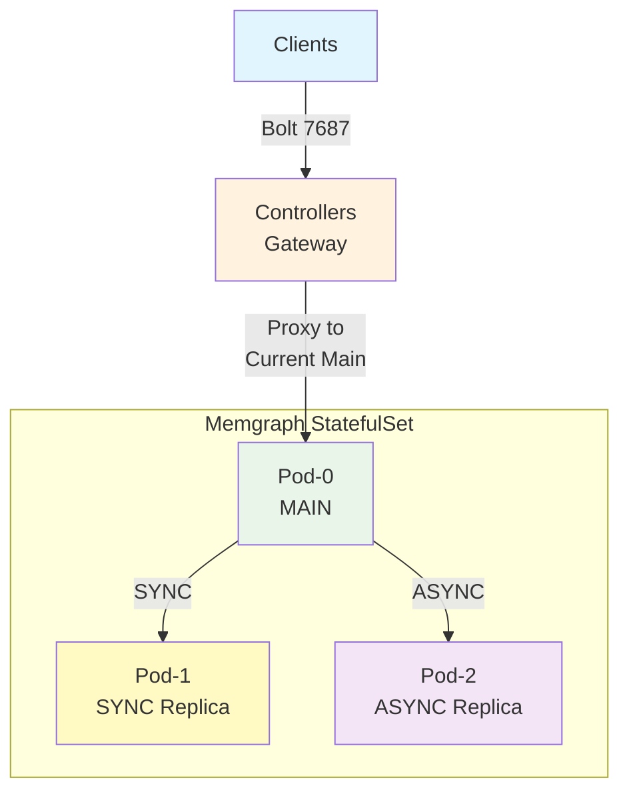

# Memgraph Controller Design Specification


## Architecture Overview

This controller implements a **MAIN-SYNC-ASYNC** replication topology that provides robust write conflict protection and automatic failover capabilities.



### Key Design Principles

1. **Two-Pod Authority**: Only pod-0 and pod-1 are eligible for MAIN/SYNC replica roles
2. **SYNC Replica Strategy**: One SYNC replica ensures zero data loss during failover
3. **Design-Contract-Based Failover**: Either pod-0 OR pod-1 MUST be SYNC replica - eliminating runtime discovery complexity
4. **Immediate Failover**: Sub-second failover response with automatic gateway coordination
5. **Write Conflict Protection**: SYNC replication prevents dual-MAIN scenarios

## Controller High Availability

Controller uses the [Lease API](https://kubernetes.io/docs/concepts/architecture/leases/#leader-election) to implement leader election.

Ground Rules:

1. Controller can scale out multiple pods, only one will be leader at any time.
2. Only leader take control of the memgraph-ha cluster, performing failover etc.
3. All controller pods can act as the gateway, forwarding traffic.
4. It is assumed that all parts of this document clearly classify controller as leader or not.

## Controller Lifecycle

Controller has two phases throughout its lifecycle: Bootstrap and Operational.

### Bootstrap Phase

Controller starts up as Bootstrap phase, which goal is load or discover current state of target memgraph-ha cluster.

During this phase, Gateway REJECTS any bolt client connections.

Below describes the rules, which are expected to be deterministic.

1. Presumption: a configmap is used to persist state of memgraph-ha cluster under control.

2. If the configmap exists, load state from configmap, and ends Bootstrap Phase and go into Operational Phase. Otherwise continues.

3. If controller pod not leader, do nothing. Waits for either (a) leader creates configmap or (b) controller became leader and run following steps.

If configmap does not exist, and controller is leader:

4. If kubernetes status of either pod-0 or pod-1 is not ready, wait. Proceed to next step ONLY after pod-0 and pod-1 are ready.

5. If both pod-0 and pod-1 have replication role as `MAIN` and storage shows 0 edge_count, 0 vertex_count, perform "Initializing Memgraph Cluster" as described in next section, and then go into Operational Phase.

6. If one of pod-0 and pod-1 has replication role as `REPLICA`, the other one as `MAIN`, set the `MAIN` pod as `TargetMainPod`, creating the configmap, and go into Operational Phase.

7. Otherwise, memgraph-ha is in an unknown state, controller log error and crash immediately, expecting human to fix the cluster.

#### Initializing Memgraph Cluster

Controller always use pod-0 as MAIN, pod-1 as SYNC REPLICA.

Controller will perform following steps to set up the cluster, and then go into OPERATIONAL phase.

1. Run this command against pod-1 to demote it into replica:

```mgconsole
SET REPLICATION ROLE TO REPLICA WITH PORT 10000
```

2. Run this command against pod-0 to set up sync replication:

```mgconsole
REGISTER REPLICA <pod_1_name> SYNC TO "<pod_1_ip>:10000"
```
3. Run this command against pod-0 to verify replication:

```mgconsole
SHOW REPLICAS
```

Replication `<pod_1_name>` should show following in `data_info` field:

```yaml
{memgraph: {behind: 0, status: "ready", ts: 0}}
```

In case replica status of `<pod_1_name>` is not "ready", log warning and do exponential retry. In such case, memgraph-controller will stay in INITIAL_STATE.

Once replication is good, controller picks pod-0 as MAIN, and then go into OPERATIONAL phase.

### Operational Phase

Once controller enters OPERATIONAL phase, controller continuously reconciles the cluster into expected status.

In this phase, controller receive events to kubernetes and do things as necessary to fix things.

#### Actions to Kubernetes Events

- Memgraph pod IP changes:
  - Controller updates pod IP information, and wait for pod ready event.
- Memgraph pod status changed to "not ready":
  - If pod is `TargetMainPod`:
    - [all controllers] Disconnect and reject all gateway connections.
    - If `TargetSyncReplica` pod status is "ready":
      - Flip `TargetMainPod` with `TargetSyncReplica`, and promote the new `TargetMainPod` immediately.
    - If `TargetSyncReplica` pod status is not "ready", controller logs error, and waits for `TargetMainPod` to recover.
  - If pod is `TargetSyncReplica`:
    - Controller logs error that MAIN will become read-only, and waits for `TargetSyncReplica` to recover.
  - If pod is neither pod-0 or pod-1:
    - Controller logs warning, drops the replication from `TargetMainPod`, and waits for async replica to recover.
- Memgraph pod status changed to "ready":
  - Controller performs reconciliation.

### Actions for Reconciliation

> **IMPLEMENTATION REQUIREMENT**: This section defines the EXACT reconciliation algorithm that MUST be implemented in code.

1. If controller is not in OPERATIONAL phase, do nothing, end the reconciliation.

2. Presumption: since controller is in OPERATIONAL phase, it knows which memgraph pod is expected to be MAIN from BOOTSTRAP phase.
   Let's define this pod as `TargetMainPod`, and the other pod-0/pod-1 pair as `TargetSyncReplica`

3. Call kubernetes api to get memgraph pods which status is "ready", available to receive traffic.

4. If `TargetMainPod` is not ready, log error, end the reconciliation.

5. Run `SHOW REPLICAS` to `TargetMainPod` to check replication status.

6. If `data_info` of `TargetSyncReplica` is not `ready`, drop the replication.

7. If `TargetSyncReplica` is not in "ready" status (i.e. not in the list of step 3), log warning.

8. If `data_info` for any ASYNC replica is not `ready`, drop the replication.

9. If replication for any pod which is not `TargetSyncReplica` is missing (could be dropped in step 3 or 4):

   1. If the pod is not ready (i.e. not in the list of step 3), log warning
   2. If the pod is ready, check replication role of the pod, if it is `MAIN`, demote it into `REPLICA`.
   3. Register ASYNC replica for the pod.

10. Once all register done, run `SHOW REPLICAS` to check final result:

   - If `data_info` of SYNC replica is not `ready`, log big error.
   - If `data_info` of ASYNC replica is not `ready`, log warning.

## Gateway Design

The controller includes an embedded TCP gateway that provides transparent failover for client connections.

The gateway handler:

1. Proxies all traffic to `TargetMainPod`.
2. Disconnect all connections when `TargetMainPod` changed.

## Deployment Characteristics

The controller manages Memgraph StatefulSets with the following operational characteristics:

- **Bootstrap Safety**: Conservative startup - refuses ambiguous cluster states
- **Operational Authority**: Enforces known topology, resolves split-brain scenarios  
- **Design-Contract-Based MAIN Selection**: Uses README.md guarantee that in OPERATIONAL state, either pod-0 or pod-1 MUST be SYNC replica - eliminating runtime discovery
- **Reconciliation**: Event-driven + periodic reconciliation with exponential backoff

