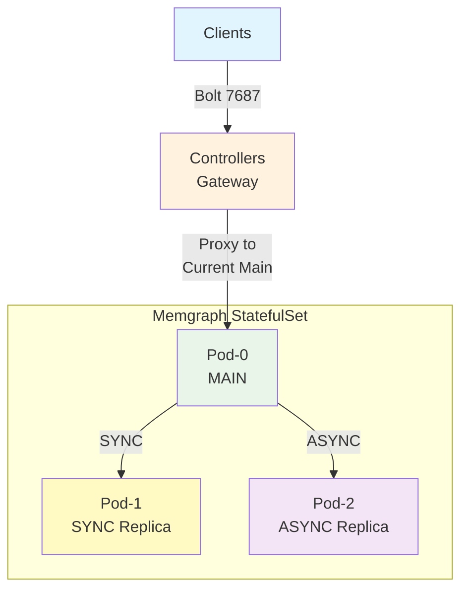

# Memgraph Controller Design Specification


## Architecture Overview

This controller implements a **MAIN-SYNC-ASYNC** replication topology that provides robust write conflict protection and automatic failover capabilities.



### Key Design Principles

1. **Two-Pod Authority**: Only pod-0 and pod-1 are eligible for MAIN/SYNC replica roles
2. **SYNC Replica Strategy**: One SYNC replica ensures zero data loss during failover
3. **Design-Contract-Based Failover**: Either pod-0 OR pod-1 MUST be SYNC replica - eliminating runtime discovery complexity
4. **Immediate Failover**: Sub-second failover response with automatic gateway coordination
5. **Write Conflict Protection**: SYNC replication prevents dual-MAIN scenarios

### Terminology and Definitions

- `TargetMainIndex`: Integer (0 or 1) stored in ConfigMap indicating which pod should be MAIN
- `TargetMainPod`: The pod derived from `TargetMainIndex`
  - e.g., if TargetMainIndex=0, then TargetMainPod is the pod with pod name "memgraph-ha-0"
- `TargetSyncReplica`: The complement pod name in the two-pod authority pair
  - e.g. if TargetMainIndex=0, then TargetSyncReplica is the pod with pod name "memgraph-ha-1"
- `data_info`: A field of memgraph `SHOW REPLICAS` output, see STUDY_NOTES.md.

## Controller High Availability

Controller uses the [Lease API](https://kubernetes.io/docs/concepts/architecture/leases/#leader-election) to implement leader election.

Ground Rules:

1. Controller can scale out multiple pods, only one will be leader at any time.
2. Reconciliation: Leader performs reconciliation logics, non-leader no-op silently.
3. Configmap: Leader writes configmap, non-leader read and update their in-memory `TargetMainPod` info.
4. All controller pods can act as the gateway, forwarding traffic.
5. All controller pods watch same set of events.
6. It is assumed that all parts of this document clearly classify controller as leader or not.

## Controller Code Flow

1. Initialization:
  - Setup informers.
  - Start HTTP service.
  - Start gateway service.
  - Start leader election.
2. Start reconciliation loop, which is described in section "Reconciliation Loop"

### Reconciliation Loop

1. If not leader then do no-op and ends the reconcile iteration.

2. If configmap does not exist, perform actions in section "Discover Cluster State".

3. Finally, perform actions in section "Reconcile Actions".

### Reconcile Actions

1. Call kubernetes api to list all memgraph pods, along with their kubernetes status (ready or not). Define this list as `podList`

2. If `TargetMainPod` is not ready, attempt to perform actions in section "Failover Actions".

3. Run `SHOW REPLICAS` to `TargetMainPod` to get registered replications. Define this list as `replicatList`.

4. If `data_info` of `TargetSyncReplica` is not "ready", drop the replication.

5. If pod status of `TargetSyncReplica` is not "ready", log warning.

6. If `data_info` for any ASYNC replica is not `ready`, drop the replication.

7. If replication for any pod which outside pod-0/pod-1 is missing (could be dropped in step 3 or 4):

   1. If the pod is not ready (i.e. not in the list of step 3), log warning
   2. If the pod is ready, check replication role of the pod, if it is `MAIN`, demote it into `REPLICA`.
   3. Register ASYNC replica for the pod.

8. Once all register done, run `SHOW REPLICAS` to check final result:

   - If `data_info` of SYNC replica is not `ready`, log big error.
   - If `data_info` of ASYNC replica is not `ready`, log warning.


### Discover Cluster State

1. If kubernetes status of either pod-0 or pod-1 is not ready, log warning and stop.

2. If both pod-0 and pod-1 have replication role as `MAIN` and storage shows 0 edge_count, 0 vertex_count, perform "Initialize Memgraph Cluster" as described in next section, and create configmaps.

3. If one of pod-0 and pod-1 has replication role as `REPLICA`, the other one as `MAIN`, set the `MAIN` pod as `TargetMainPod`, and create configmap.

4. Otherwise, memgraph-ha is in an unknown state, controller log error and crash immediately, expecting human to fix the cluster.

### Initialize Memgraph Cluster

Controller always use pod-0 as MAIN, pod-1 as SYNC REPLICA.

1. Run this command against pod-1 to demote it into replica:

```mgconsole
SET REPLICATION ROLE TO REPLICA WITH PORT 10000
```

2. Run this command against pod-0 to set up sync replication:

```mgconsole
REGISTER REPLICA <pod_1_name> SYNC TO "<pod_1_ip>:10000"
```
3. Run this command against pod-0 to verify replication:

```mgconsole
SHOW REPLICAS
```

Replication `<pod_1_name>` should show following in `data_info` field:

```yaml
{memgraph: {behind: 0, status: "ready", ts: 0}}
```

Once replication is good, controller picks pod-0 as MAIN, and create configmap.


### Actions to Kubernetes Events

- **Memgraph pod status changed to "not ready"**:
  - **If pod is `TargetMainPod`:**
    - **[ALL controllers]** Immediately terminate all gateway connections
    - **[ALL controllers]** Gateway rejects new connections (main unavailable state)
    - **[Leader only]** Flip `TargetMainPod` with `TargetSyncReplica`
    - **[Leader only]** Promote new `TargetMainPod` immediately
    - **[Leader only]** Update ConfigMap with new `TargetMainIndex`
    - **[ALL controllers]** Receive ConfigMap update → Gateway accepts connections to new main
  - **If pod is `TargetSyncReplica`:**
    - Controller logs error that MAIN will become read-only
    - Wait for `TargetSyncReplica` to recover
  - **If pod is neither pod-0 or pod-1:**
    - Drop replication from `TargetMainPod`
    - Wait for async replica to recover

## Gateway Design

The controller includes an embedded TCP gateway that provides transparent failover for client connections.

1. On new connection: if pod status of `TargetMainPod` is ready, proxy to `TargetMainPod`, otherwise reject connection.
2. When `TargetMainPod` has changed (failover happening): immediately disconnect all connections.

### Expected Client Experience on Failover

- **Connection Window**: Eliminated - no connections to failed main possible
- **Client Disruption**: Single clean reconnection (1-3 seconds)
- **Error Elimination**: No connection failures to dead main
- **Failover Visibility**: Transparent to clients via coordinated gateway rejection

## Deployment Characteristics

The controller manages Memgraph StatefulSets with the following operational characteristics:

- **Bootstrap Safety**: Conservative startup - refuses ambiguous cluster states
- **Operational Authority**: Enforces known topology, resolves split-brain scenarios  
- **Design-Contract-Based MAIN Selection**: Uses README.md guarantee that in OPERATIONAL state, either pod-0 or pod-1 MUST be SYNC replica - eliminating runtime discovery
- **Reconciliation**: Event-driven + periodic reconciliation with exponential backoff

