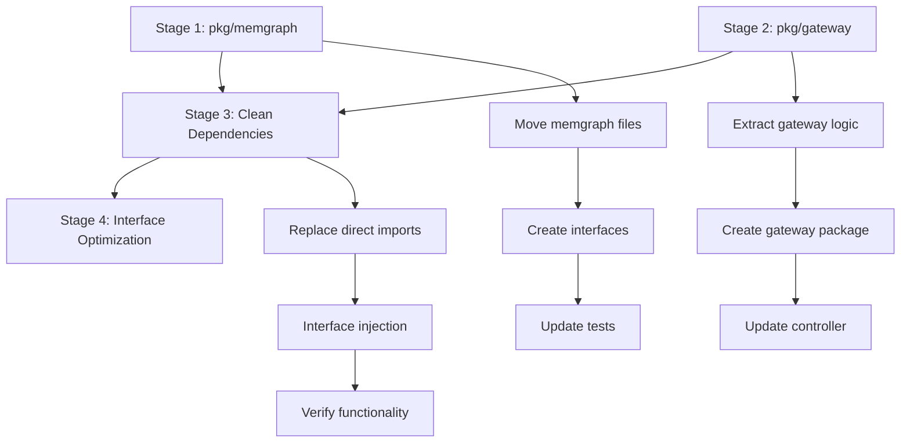

# Implementation Plan - Package Architecture Refactor

## Objective
Refactor the monolithic `pkg/controller` package (6,249 lines, 24 files) into focused, maintainable packages with clear separation of concerns and improved testability.

## Current Architecture Analysis

**pkg/controller currently contains:**
- Controller orchestration logic (12 files, ~3,000 lines)
- Gateway/proxy functionality (2 files, ~400 lines) 
- Memgraph protocol handling (6 files, ~2,000 lines)
- Supporting infrastructure (4 files, ~800 lines)

## Target Package Structure

### pkg/controller
**Purpose**: Kubernetes controller orchestration and cluster management
**Responsibilities**:
- Kubernetes reconciliation loop and event handling
- Leader election and HA coordination
- ConfigMap state management
- Pod lifecycle management

**Files to retain**:
- `controller_core.go` - Core controller struct and initialization
- `controller_reconcile.go` - Reconciliation loop implementation
- `controller_events.go` - Kubernetes event handlers
- `leader_election.go` - Leader election logic
- `config.go` - Controller configuration
- `kubernetes.go` - Kubernetes API interactions
- `types.go` - Controller-specific types
- `queue_*.go` - Event queue management
- Test files for above components

### pkg/gateway
**Purpose**: Client connection management and request proxying
**Responsibilities**:
- Bolt protocol proxying to current main
- Client connection lifecycle
- Load balancing and failover routing
- Gateway server management

**Files to move**:
- Extract from `controller_core.go`: Gateway server logic
- Extract from `http_server.go`: Gateway HTTP endpoints
- Create `gateway.go` - Core gateway struct and logic
- Create `proxy.go` - Bolt connection proxying
- Create `server.go` - Gateway server management
- Create `routing.go` - Request routing logic
- Gateway-specific tests

### pkg/memgraph
**Purpose**: Memgraph database protocol and operations
**Responsibilities**:
- Bolt driver connection management
- Memgraph query execution and parsing
- Replication commands and status parsing
- Connection pooling to Memgraph instances

**Files to move**:
- `memgraph_client.go` - Query execution and parsing
- `connection_pool.go` - Connection pool management
- `replication.go` - Replication command handling
- `memgraph_cluster.go` - Cluster state querying
- `memgraph_node.go` - Individual node operations
- All memgraph-specific tests and data parsing logic

## Stage 1: Create pkg/memgraph Foundation
**Goal**: Extract Memgraph protocol handling into isolated package
**Success Criteria**:
- All Bolt driver interactions isolated to pkg/memgraph
- Clean interfaces for controller to consume Memgraph operations
- Connection pool management abstracted
- All existing Memgraph tests pass in new package

**Key Tasks**:
- Move `memgraph_client.go`, `connection_pool.go`, `replication.go` to pkg/memgraph
- Extract Memgraph-specific types from `types.go`
- Create clean interfaces: `Client`, `ConnectionPool`, `ClusterState`
- Update imports in pkg/controller to use new package
- Migrate and adapt all related tests

**Tests**:
- All existing Memgraph client tests pass
- Connection pool tests pass with new structure
- Mock interfaces work correctly with controller

**Estimated Impact**: ~2,000 lines moved, 6 files relocated
**Status**: Not Started

## Stage 2: Extract pkg/gateway 
**Goal**: Separate gateway/proxy functionality into dedicated package
**Success Criteria**:
- Gateway server logic isolated from controller
- Clean interface for controller to manage gateway lifecycle
- Proxy routing logic abstracted and testable
- Gateway can be started/stopped independently

**Key Tasks**:
- Extract gateway logic from `controller_core.go`
- Create `gateway.go` with Gateway struct and lifecycle methods
- Move proxy routing logic to `proxy.go`
- Create clean interface: `Gateway` with Start/Stop/UpdateRouting methods
- Update controller to use gateway interface

**Tests**:
- Gateway can start/stop independently
- Proxy routing works with mock backends
- Controller integration tests pass with new gateway

**Estimated Impact**: ~400 lines moved, 3 new files created
**Status**: Not Started

## Stage 3: Clean pkg/controller Dependencies
**Goal**: Simplify controller package by removing direct protocol dependencies
**Success Criteria**:
- Controller only imports pkg/memgraph and pkg/gateway interfaces
- No direct neo4j driver imports in controller package
- Clean dependency graph: controller → gateway/memgraph → external libs
- All existing controller functionality preserved

**Key Tasks**:
- Replace direct Memgraph client usage with interface calls
- Replace direct gateway calls with interface methods
- Remove neo4j driver imports from controller files
- Update dependency injection in main.go
- Ensure all controller tests use mocked interfaces

**Tests**:
- All existing controller tests pass with mocked dependencies
- Integration tests validate end-to-end functionality
- Unit tests for each package work independently

**Estimated Impact**: Interface refactoring across remaining controller files
**Status**: Not Started

## Stage 4: Interface Optimization and Testing
**Goal**: Optimize interfaces and ensure comprehensive test coverage
**Success Criteria**:
- Minimal, focused interfaces between packages
- 90%+ test coverage for each package
- Mock implementations available for all interfaces
- Documentation for public APIs

**Key Tasks**:
- Review and optimize interfaces for minimal coupling
- Add comprehensive unit tests for each package
- Create mock implementations for testing
- Add package-level documentation
- Performance testing for interface boundaries

**Tests**:
- Unit test coverage >90% for each package
- Integration tests cover cross-package interactions
- Performance tests show no regression
- Mock interfaces enable fast testing

**Estimated Impact**: Test infrastructure and documentation additions
**Status**: Not Started

## Implementation Order and Dependencies

## Benefits of This Refactor

### Maintainability
- **Clear Separation**: Each package has single, focused responsibility
- **Reduced Complexity**: Individual packages easier to understand and modify
- **Modular Design**: Changes in one area don't ripple across unrelated code

### Testability  
- **Isolated Testing**: Test Memgraph logic without controller complexity
- **Mock Interfaces**: Easy to mock dependencies for fast unit tests
- **Integration Boundaries**: Clear testing points between packages

### Reusability
- **pkg/memgraph**: Could be used by other Memgraph tools/controllers
- **pkg/gateway**: Reusable proxy pattern for other database systems
- **Composable Architecture**: Mix and match components as needed

### Code Quality
- **Interface-Driven**: Forces clean API design between components  
- **Dependency Clarity**: Clear dependency graph prevents circular imports
- **Single Responsibility**: Each package has one reason to change

## Migration Safety

### Backwards Compatibility
- All existing functionality preserved during refactor
- No changes to external APIs during transition
- Gradual migration allows rollback at each stage

### Testing Strategy
- Existing tests must pass after each stage
- New tests added for interface boundaries  
- Integration tests verify end-to-end functionality

### Risk Mitigation
- Each stage can be completed and tested independently
- Small, focused changes reduce risk of large-scale breakage
- Clear rollback points if issues arise

## Quality Gates

### Per-Stage Requirements
- [ ] All existing tests pass
- [ ] No functionality regressions  
- [ ] Clean interfaces with minimal coupling
- [ ] Comprehensive test coverage for new package structure
- [ ] Performance benchmarks show no degradation

### Final Success Criteria
- [ ] pkg/controller: <2,000 lines, pure orchestration logic
- [ ] pkg/gateway: <800 lines, focused on proxying and routing
- [ ] pkg/memgraph: <2,000 lines, pure Memgraph protocol handling  
- [ ] Clear dependency graph: controller → gateway/memgraph → external
- [ ] 90%+ test coverage across all packages
- [ ] All existing E2E tests pass without modification

## Notes
- Each stage must be completed and validated before proceeding
- Update this document's Status field after completing each stage  
- Remove this file when all stages are complete and architecture is stable