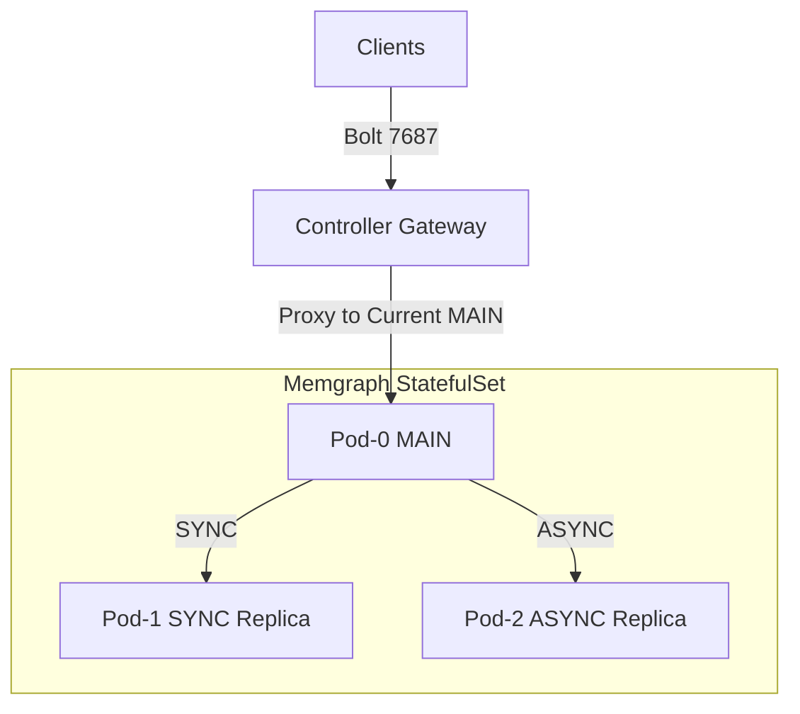

# Memgraph Controller with Gateway

A Kubernetes controller that manages Memgraph clusters with built-in TCP gateway for transparent failover.

> **📋 Design Reference**: See [DESIGN.md](./DESIGN.md) for detailed architecture and implementation specifications.

## Features

- **MAIN-SYNC-ASYNC Topology**: Zero data loss failover with write conflict protection
- **Two-Pod Authority**: Only pod-0 and pod-1 eligible for MAIN/SYNC replica roles  
- **Immediate Failover**: Sub-second failover response with automatic gateway coordination
- **Bootstrap Safety**: Conservative startup that refuses ambiguous cluster states
- **Transparent Gateway**: Raw TCP proxy with automatic connection management

## Quick Start

### Prerequisites

- Kubernetes cluster with kubectl access
- Memgraph Helm chart repository
- Docker for building custom images

### Basic Deployment

1. **Deploy with Helm:**
```bash
helm repo add memgraph https://memgraph.github.io/helm-charts
helm install memgraph-ha memgraph/memgraph-ha
```

2. **Verify Deployment:**
```bash
kubectl get pods -n memgraph
kubectl logs -l app=memgraph-controller -n memgraph
```

3. **Connect via Gateway:**
```bash
# Gateway provides transparent access to current MAIN
kubectl port-forward svc/memgraph-controller 7687:7687 -n memgraph
```

### Configuration

Key environment variables for the controller:

```bash
# Gateway settings
GATEWAY_ENABLED=true
GATEWAY_BIND_ADDRESS=0.0.0.0:7687
GATEWAY_MAX_CONNECTIONS=1000

# Controller settings  
RECONCILE_INTERVAL=30s
LOG_LEVEL=info
```

## Architecture

The controller implements a **MAIN-SYNC-ASYNC** replication topology:



**Key Benefits:**
- **Zero Data Loss**: SYNC replica ensures all committed transactions are replicated
- **Write Protection**: SYNC replication prevents dual-MAIN scenarios
- **Fast Failover**: SYNC replica can be promoted immediately without data loss
- **Client Transparency**: Gateway handles connection routing automatically

## Gateway Integration

The controller includes an embedded TCP gateway that provides transparent failover for client connections:

### Features
- **Transparent Proxying**: Raw TCP proxy to current MAIN (no protocol interpretation)
- **Automatic Failover**: Terminates all connections on MAIN change, clients reconnect to new MAIN
- **Connection Tracking**: Full session lifecycle management with metrics
- **Health Monitoring**: MAIN connectivity validation and error rate tracking

### Configuration
```bash
# Enable gateway functionality
GATEWAY_ENABLED=true
GATEWAY_BIND_ADDRESS=0.0.0.0:7687
GATEWAY_MAX_CONNECTIONS=1000
GATEWAY_TIMEOUT=30s
```

## Monitoring

The controller exposes comprehensive metrics through its HTTP API:

- **Cluster State**: MAIN/replica roles, replication status
- **Gateway Stats**: Active connections, failover count, error rates  
- **Health Status**: MAIN connectivity, error thresholds, system health

Access metrics at: `http://controller:8080/status`

## Memgraph Specifications

For detailed Memgraph Community Edition specifications, commands, and replication reference, see [STUDY_NOTES.md](./STUDY_NOTES.md).
