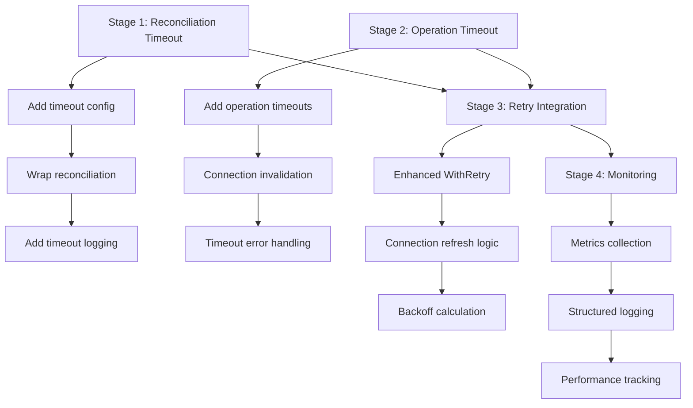

# Context Timeout Strategy - Design Document

## Objective
Implement robust timeout handling in the memgraph-controller to prevent stuck operations from blocking the reconciliation loop and ensure reliable cluster failover operations.

## Current State Analysis

### Existing Architecture
- **Reconciliation Interval**: 30 seconds (configurable via `RECONCILE_INTERVAL`)
- **Context Usage**: Context passed through call chains but no timeouts applied
- **Stuck Operation Risk**: Database operations like `SET REPLICATION ROLE` can hang indefinitely
- **Recovery Mechanism**: Connection invalidation exists but not utilized for timeout recovery

### Problems Identified
1. **Unbounded Operations**: Memgraph commands have no time limits
2. **Reconciliation Blocking**: Single stuck operation can block entire controller
3. **No Recovery Strategy**: Stuck connections persist until manual intervention
4. **Resource Leaks**: Hanging connections accumulate over time

## Design Principles

### 1. Reconciliation-Scoped Timeouts
Rather than timing out individual operations, bound the entire reconciliation cycle:
- **Rationale**: Matches Kubernetes controller patterns
- **Benefit**: Natural retry mechanism via next reconciliation cycle
- **Safety**: Prevents cascading timeout complexity

### 2. Graceful Degradation
Controller continues operating even when some operations fail:
- **Resilience**: One failed operation doesn't stop the controller
- **Observability**: Failed operations are logged and monitored
- **Recovery**: Next cycle attempts fresh connections

### 3. Connection Lifecycle Management
Leverage existing connection invalidation for timeout recovery:
- **Clean State**: Remove stuck connections automatically
- **Fresh Retry**: Next operation gets new driver instance
- **Resource Cleanup**: Prevent connection pool bloat

## Proposed Implementation

### Stage 1: Reconciliation Timeout Framework
**Goal**: Add configurable timeout boundary for entire reconciliation cycle
**Success Criteria**: 
- Reconciliation cycles complete within configured timeout
- Timeout violations logged with operation context
- Controller continues running after timeouts

**Implementation**:

```go
// Configuration additions
type Config struct {
    // Existing fields...
    ReconcileTimeout time.Duration  // New: Max time for reconciliation cycle
}

// In config.go Load()
reconcileTimeout, err := time.ParseDuration(getEnvOrDefault("RECONCILE_TIMEOUT", "25s"))
config.ReconcileTimeout = reconcileTimeout

// In controller_reconcile.go
func (c *MemgraphController) performReconciliationActions(ctx context.Context) error {
    // Create bounded context for entire reconciliation
    reconcileCtx, cancel := context.WithTimeout(ctx, c.config.ReconcileTimeout)
    defer cancel()
    
    start := time.Now()
    defer func() {
        duration := time.Since(start)
        if duration > c.config.ReconcileTimeout {
            logger.Warn("Reconciliation exceeded timeout", 
                "duration_ms", duration.Milliseconds(),
                "timeout_ms", c.config.ReconcileTimeout.Milliseconds())
        }
        logger.Info("performReconciliationActions completed", "duration_ms", duration.Milliseconds())
    }()
    
    return c.doReconciliationSteps(reconcileCtx)
}
```

**Tests**:
- Reconciliation completes within timeout under normal conditions
- Timeout violations are properly logged
- Controller survives reconciliation timeouts
- Next cycle operates normally after timeout

**Estimated Impact**: ~100 lines added, 2 files modified
**Status**: Not Started

### Stage 2: Operation-Level Timeout Boundaries  
**Goal**: Add shorter timeouts to individual database operations
**Success Criteria**:
- Database operations respect context cancellation
- Failed operations don't block reconciliation completion
- Connection invalidation triggered on operation timeouts

**Implementation**:

```go
// Configuration for operation timeouts
type Config struct {
    // Existing fields...
    OperationTimeout time.Duration  // New: Max time for individual operations
}

// In memgraph_client.go
func (mc *MemgraphClient) SetReplicationRoleToMainWithRetry(ctx context.Context, boltAddress string) error {
    // Create operation-scoped timeout (shorter than reconciliation timeout)
    opCtx, cancel := context.WithTimeout(ctx, mc.config.OperationTimeout)
    defer cancel()
    
    err := WithRetry(opCtx, func() error {
        return mc.SetReplicationRoleToMain(opCtx, boltAddress)
    }, mc.retryConfig)
    
    // On timeout, invalidate the connection for next cycle
    if errors.Is(err, context.DeadlineExceeded) {
        logger.Warn("Operation timed out, invalidating connection", 
            "bolt_address", boltAddress, 
            "timeout", mc.config.OperationTimeout)
        mc.connectionPool.InvalidateConnection(boltAddress)
    }
    
    return err
}
```

**Tests**:
- Individual operations respect timeout boundaries  
- Connection invalidation occurs on timeouts
- Retry logic works within operation timeout
- Stuck connections are cleaned up

**Estimated Impact**: ~200 lines modified across memgraph_client.go methods
**Status**: Not Started

### Stage 3: Retry Strategy Integration
**Goal**: Integrate timeout handling with existing retry mechanisms
**Success Criteria**:
- Retries respect both operation and reconciliation timeouts
- Connection refresh occurs between retry attempts on timeout
- Retry backoff doesn't exceed remaining reconciliation time

**Implementation**:

```go
// Enhanced WithRetry function
func WithRetryAndTimeout(ctx context.Context, operation func() error, retryConfig RetryConfig, connectionRefresh func() error) error {
    var lastErr error
    
    for attempt := 0; attempt <= retryConfig.MaxRetries; attempt++ {
        // Check if we have time remaining in context
        select {
        case <-ctx.Done():
            return ctx.Err()
        default:
        }
        
        err := operation()
        if err == nil {
            return nil
        }
        
        lastErr = err
        
        // If operation timed out, refresh connection before retry
        if errors.Is(err, context.DeadlineExceeded) && connectionRefresh != nil {
            if refreshErr := connectionRefresh(); refreshErr != nil {
                logger.Warn("Failed to refresh connection", "error", refreshErr)
            }
        }
        
        if attempt == retryConfig.MaxRetries {
            break
        }
        
        // Calculate backoff, but don't exceed remaining context time
        backoff := calculateBackoff(attempt, retryConfig)
        if deadline, ok := ctx.Deadline(); ok {
            remaining := time.Until(deadline)
            if backoff > remaining {
                backoff = remaining / 2 // Leave some time for final attempt
            }
        }
        
        select {
        case <-time.After(backoff):
        case <-ctx.Done():
            return ctx.Err()
        }
    }
    
    return lastErr
}
```

**Tests**:
- Retries complete within reconciliation timeout bounds
- Connection refresh works correctly between retries  
- Backoff calculation respects remaining context time
- Final retry attempts have sufficient time allocation

**Estimated Impact**: ~150 lines modified in connection_pool.go and memgraph_client.go
**Status**: Not Started

### Stage 4: Monitoring and Observability
**Goal**: Add metrics and logging for timeout analysis and debugging
**Success Criteria**:
- Timeout violations tracked with structured metrics
- Operation timing data available for performance analysis
- Connection pool health visible in logs and metrics

**Implementation**:

```go
// Timeout tracking metrics
type TimeoutMetrics struct {
    ReconciliationTimeouts    int64
    OperationTimeouts        int64
    ConnectionInvalidations  int64
    AverageOperationDuration time.Duration
}

// Enhanced logging in operations
func (mc *MemgraphClient) logOperationMetrics(operation string, duration time.Duration, err error) {
    logger.Info("operation completed",
        "operation", operation,
        "duration_ms", duration.Milliseconds(),
        "success", err == nil,
        "timeout", errors.Is(err, context.DeadlineExceeded))
        
    // Update metrics
    mc.metrics.RecordOperation(operation, duration, err)
}
```

**Tests**:
- Metrics accurately track timeout events
- Logging provides sufficient debugging information
- Performance data helps identify slow operations
- Connection pool metrics show healthy state

**Estimated Impact**: ~100 lines added for metrics and enhanced logging
**Status**: Not Started

## Configuration Strategy

### Environment Variables
```bash
# Reconciliation cycle timeout (must be less than RECONCILE_INTERVAL)
RECONCILE_TIMEOUT=25s

# Individual operation timeout (should be much shorter than RECONCILE_TIMEOUT)  
OPERATION_TIMEOUT=10s

# Existing - reconciliation interval
RECONCILE_INTERVAL=30s
```

### Validation Rules
- `RECONCILE_TIMEOUT` must be less than `RECONCILE_INTERVAL` (leave buffer for setup/cleanup)
- `OPERATION_TIMEOUT` must be less than `RECONCILE_TIMEOUT` (allow multiple operations per cycle)
- Recommended ratios:
  - `RECONCILE_TIMEOUT` = 80-85% of `RECONCILE_INTERVAL`
  - `OPERATION_TIMEOUT` = 30-40% of `RECONCILE_TIMEOUT`

## Recovery Mechanisms

### Automatic Recovery
1. **Connection Invalidation**: Remove stuck drivers from pool
2. **Fresh Connections**: Next operation gets new driver instance  
3. **Retry in Next Cycle**: Natural retry via reconciliation loop
4. **State Refresh**: Cluster state re-queried each cycle

### Manual Intervention
- **Pod Restart**: If controller becomes unresponsive
- **Connection Pool Reset**: Via HTTP API endpoint (future enhancement)
- **Configuration Adjustment**: Tune timeouts based on cluster behavior

## Risk Analysis and Mitigation

### Risks
1. **False Positive Timeouts**: Network slowness causing premature timeouts
2. **Incomplete Operations**: Operations interrupted mid-execution
3. **Resource Thrashing**: Constant connection recreation under load
4. **Configuration Complexity**: Wrong timeout values causing instability

### Mitigation Strategies
1. **Conservative Defaults**: Start with generous timeouts, tune based on metrics
2. **Idempotent Operations**: Ensure operations can be safely retried
3. **Connection Pool Limits**: Prevent unbounded connection creation
4. **Validation**: Runtime validation of timeout configuration relationships

## Success Metrics

### Functional Requirements
- [ ] Reconciliation cycles complete within configured timeout 95% of the time
- [ ] Stuck operations recover within 2 reconciliation cycles
- [ ] Controller maintains availability during network issues
- [ ] Connection pool size remains bounded under all conditions

### Performance Requirements  
- [ ] No performance regression in normal operation
- [ ] Timeout overhead < 1% of operation time
- [ ] Memory usage remains stable with timeout features
- [ ] Log volume increase < 10% with timeout logging

### Operational Requirements
- [ ] Clear documentation for timeout configuration
- [ ] Debugging information available for timeout incidents
- [ ] Metrics suitable for alerting on timeout patterns
- [ ] Recovery procedures documented for operators

## Implementation Order and Dependencies



## Quality Gates

### Per-Stage Requirements
- [ ] All existing tests pass after timeout implementation
- [ ] New tests validate timeout behavior under various conditions
- [ ] Performance benchmarks show minimal overhead
- [ ] Configuration validation prevents invalid timeout combinations
- [ ] Recovery mechanisms tested with simulated stuck operations

### Final Success Criteria
- [ ] Controller survives extended periods of network instability
- [ ] Timeout violations automatically trigger recovery procedures  
- [ ] Operational visibility sufficient for troubleshooting timeout issues
- [ ] Performance impact of timeout framework < 5% overhead
- [ ] Documentation covers timeout configuration and troubleshooting

## Notes
- Timeout values should be tuned based on actual cluster behavior and network conditions
- Monitor timeout metrics in production to identify optimal configuration
- Consider implementing adaptive timeouts based on historical operation performance
- Remove this document when timeout strategy is fully implemented and validated