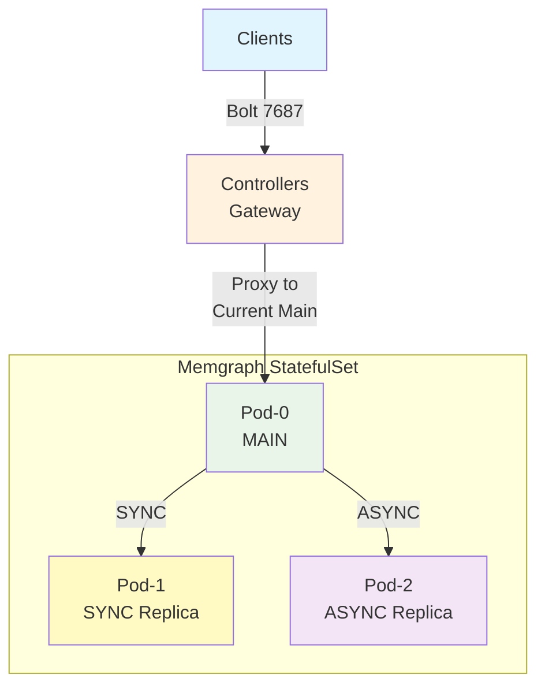

# Memgraph Controller Architecture

## Architecture Overview

This controller implements a **MAIN-SYNC-ASYNC** replication topology that provides robust write conflict protection and automatic failover capabilities.

## Key Design Principles

1. **Two-Pod Authority**: Only pod-0 and pod-1 are eligible for MAIN/SYNC replica roles
2. **SYNC Replica Strategy**: One SYNC replica ensures zero data loss during failover
3. **Design-Contract-Based Failover**: Either pod-0 OR pod-1 MUST be SYNC replica - eliminating runtime discovery complexity
4. **Immediate Failover**: Sub-second failover response with automatic gateway coordination
5. **Write Conflict Protection**: SYNC replication prevents dual-MAIN scenarios

## Terminology and Definitions

- `TargetMainIndex`: Integer (0 or 1) stored in ConfigMap indicating which pod should be MAIN
- `TargetMainPod`: The pod derived from `TargetMainIndex`
  - e.g., if TargetMainIndex=0, then TargetMainPod is the pod with pod name "memgraph-ha-0"
- `TargetSyncReplica`: The complement pod name in the two-pod authority pair
  - e.g. if TargetMainIndex=0, then TargetSyncReplica is the pod with pod name "memgraph-ha-1"
- `data_info`: A field of memgraph `SHOW REPLICAS` output, see STUDY_NOTES.md.

## Controller High Availability

Controller uses the [Lease API](https://kubernetes.io/docs/concepts/architecture/leases/#leader-election) to implement leader election.

### Ground Rules:

1. Controller can scale out multiple pods, only one will be leader at any time.
2. Reconciliation: Leader performs reconciliation logics, non-leader no-op silently.
3. Configmap: Leader writes configmap, non-leader read and update their in-memory `TargetMainPod` info.
4. Only leader can act as the gateway, forwarding traffic.
5. All controller pods watch same set of events.
6. It is assumed that all parts of this document clearly classify controller as leader or not.

## Gateway Design

The controller includes an embedded TCP gateway that provides transparent failover for client connections.

1. On new connection: if pod status of `TargetMainPod` is ready, proxy to `TargetMainPod`, otherwise reject connection.
2. When `TargetMainPod` has changed (failover happening): immediately disconnect all connections.

### Expected Client Experience on Failover

- **Connection Window**: Eliminated - no connections to failed main possible
- **Client Disruption**: Single clean reconnection (1-3 seconds)
- **Error Elimination**: No connection failures to dead main
- **Failover Visibility**: Transparent to clients via coordinated gateway rejection

## Deployment Characteristics

The controller manages Memgraph StatefulSets with the following operational characteristics:

- **Bootstrap Safety**: Conservative startup - refuses ambiguous cluster states
- **Operational Authority**: Enforces known topology, resolves split-brain scenarios  
- **Design-Contract-Based MAIN Selection**: Uses guarantee that in OPERATIONAL state, either pod-0 or pod-1 MUST be SYNC replica - eliminating runtime discovery
- **Reconciliation**: Event-driven + periodic reconciliation with exponential backoff

## Connection Management

The controller maintains a connection pool with the following characteristics:

- **IP Tracking**: Monitors and updates pod IP addresses as they change
- **Connection Invalidation**: Automatically invalidates connections when pods are deleted or become unhealthy
- **Lazy Connection**: Establishes connections only when needed to reduce resource usage
- **Connection Reuse**: Maintains persistent connections to healthy pods for efficiency

## Related Documents

- For reconciliation logic, see [reconciliation.md](./reconciliation.md)
- For failover strategy, see [failover.md](./failover.md)
- For implementation details, see the codebase mapping in [reconciliation.md](./reconciliation.md#implementation-references)